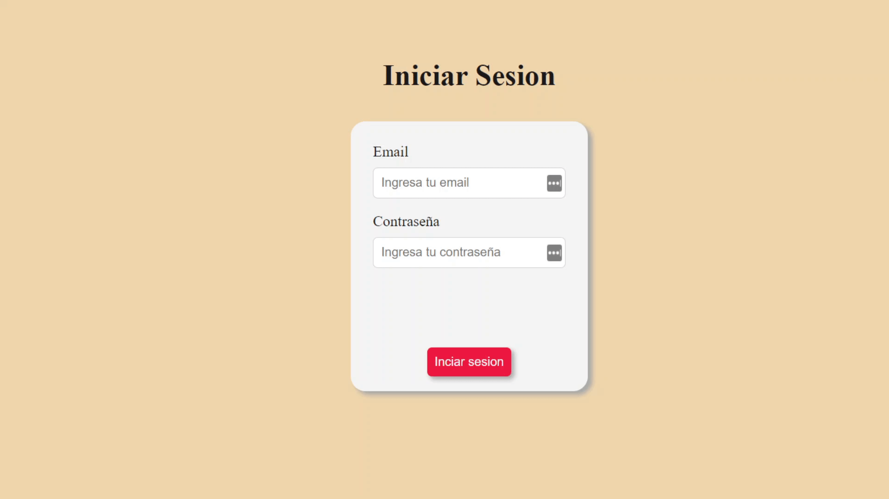

# Ejercicio de Práctica. ✏️

En el presente ejercicio, continuaremos trabajando sobre el formulario de login que vimos anteriormente.

La consigna del ejercicio, consiste en mantener iniciada la sesión del usuario, almacenando para ello la infomación de la persona en el localStorage una vez que la misma se encuentre logueada; en base a dicha información, podremos luego validar si la sesión ha sido iniciada o no, y sobre dicha base decidir que elementos mostrarle a la persona cuando se cargue la página.

Por otra parte, deberemos dar a la persona la posibilidad de cerrar la sesión, en cuyo caso habrá que realizar los pasos necesarios para limpiar la información almacenada, y redirigirlo nuevamente al formulario de login.

Para resolver esta actividad, deberás examinar y prestar atención a los distintos tags html y sus distintas propiedades, para ver de que manera puedes seleccionar y manipular cada elemento mediante javascript. De la misma manera, en el archivo styles.css, te dejamos algunos estilos que podrán serte de utilidad para realizar la tarea asignada. 👀 👀 👀

## Ejemplo:

Puedes ver el comportamiento de la aplicación en la siguiente imagen:

A programar! 💻
